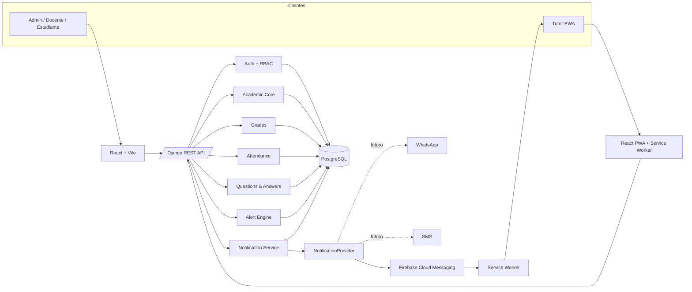
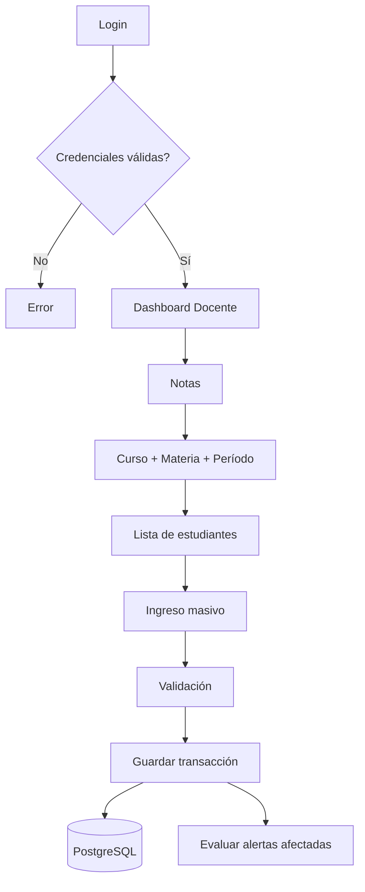
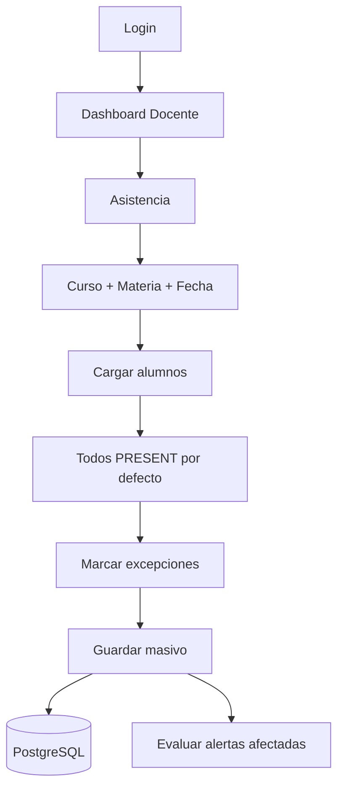
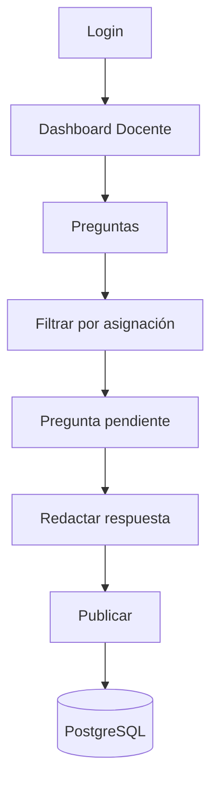
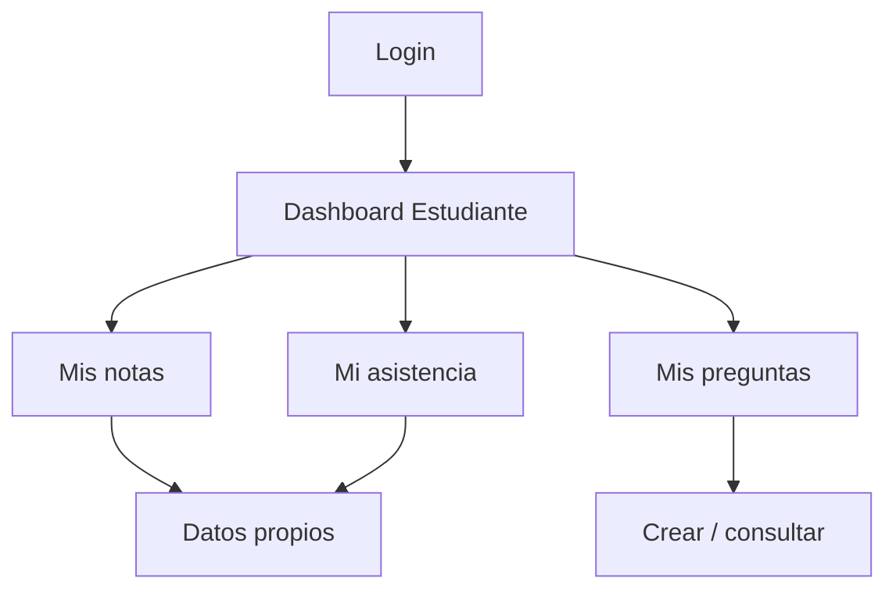
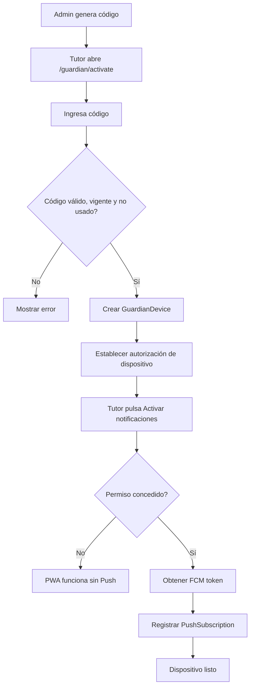
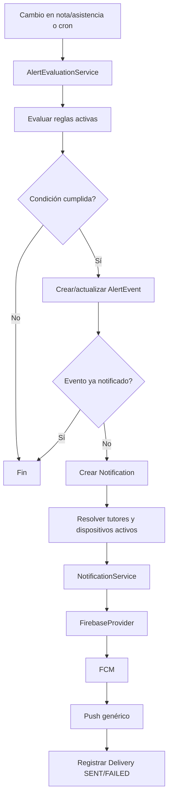

# SDD MASTER — Sistema Web de Notas, Asistencia, Preguntas y Notificaciones Push

**Proyecto:** Diseño e implementación de sistema web para el registro de notas y asistencia en el Colegio Gabriel René Moreno II de Comarapa  
**Versión:** 2.0 — MVP PWA + Firebase  
**Fecha:** 2026-08-29  
**Estado:** Fuente de verdad de implementación

---

## 1. Objetivo

Definir una arquitectura implementable con rapidez para un MVP académico que digitalice notas, asistencia, preguntas/respuestas y alertas a tutores sin depender de la publicación/verificación de WhatsApp Business.

El MVP debe ser demostrable, seguro a nivel básico, fácil de desplegar y suficientemente modular para agregar WhatsApp/SMS más adelante sin reescribir la lógica académica.

---

## 2. Alcance funcional MVP

### 2.1 Actores

#### Administrador

- Gestiona usuarios internos.
- Gestiona estudiantes, docentes, tutores, cursos, materias y períodos.
- Asigna docente a curso/materia.
- Define reglas de alerta.
- Genera códigos de activación para tutores.
- Consulta historial de notificaciones y auditoría.

#### Docente

- Accede únicamente a sus asignaciones.
- Registra y edita notas de sus estudiantes.
- Registra asistencia.
- Consulta reportes de sus cursos.
- Responde preguntas de estudiantes vinculados a sus asignaciones.

#### Estudiante

- Consulta sus propias notas.
- Consulta su propia asistencia, faltas y atrasos.
- Crea preguntas para sus materias.
- Consulta respuestas.

#### Padre/Tutor

- No posee rol académico ni panel administrativo.
- No necesita usuario/contraseña tradicional.
- Instala/usa la PWA de notificaciones.
- Vincula el dispositivo con un código temporal de activación.
- Autoriza notificaciones Push.
- Recibe avisos genéricos y abre el detalle autorizado dentro de la PWA.
- Puede tener varios estudiantes vinculados; un estudiante puede tener varios tutores.

---

## 3. Decisiones arquitectónicas

### ADR-001 — Monolito modular

**Decisión:** Django/DRF en un único backend y PostgreSQL en una única base.

**Razón:** el diseño conceptual original separa notas, asistencia y reporting, pero para un MVP escolar no justifica la complejidad operativa de microservicios.

### ADR-002 — PWA en lugar de app nativa

**Decisión:** React/Vite se convierte en PWA instalable.

**Razón:** reutiliza el frontend existente, evita Play Store/App Store y permite Push Web con FCM.

### ADR-003 — FCM como provider principal del MVP

**Decisión:** Firebase Cloud Messaging será el canal de notificación del MVP.

**Razón:** elimina la dependencia de verificación/publicación de negocio de WhatsApp Cloud API.

### ADR-004 — Tutor sin cuenta académica

**Decisión:** `Guardian` no se convierte en `User`. El acceso se realiza mediante un dispositivo autorizado y una credencial limitada derivada de un código de activación.

**Razón:** mantiene la premisa funcional de que padres/tutores no operan el sistema académico.

### ADR-005 — Provider desacoplado

**Decisión:** la lógica de alertas invoca `NotificationProvider`; FCM es una implementación.

**Razón:** permite sumar WhatsApp/SMS/email posteriormente.

---

## 4. Stack tecnológico

| Capa | Tecnología | Decisión MVP |
|---|---|---|
| Frontend | React + Vite + TypeScript | SPA única para internos y PWA tutor |
| UI | Tailwind CSS | Componentes simples y responsive |
| PWA | Manifest + Service Worker | Instalable, shell básico, no cachear datos sensibles |
| Push | Firebase Cloud Messaging | Canal principal del tutor |
| Backend | Django + Django REST Framework | Monolito modular |
| Auth internos | JWT | Access corto; refresh protegido |
| Auth tutor | Código one-time + dispositivo autorizado | Sin cuenta académica |
| DB | PostgreSQL | Única fuente de datos |
| Scheduler | Django management command + cron | Sin Redis/Celery en MVP |
| Proxy | Nginx | Sirve frontend, proxy `/api`, TLS |
| Contenedores | Docker Compose | Repetible y suficiente para MVP |
| Backend tests | Pytest + DRF test client | P0 y seguridad |
| Frontend tests | Vitest | Lógica/UI crítica |

---

## 5. Arquitectura de alto nivel



---

## 6. Dominios internos Django

Se recomienda separar por apps Django, manteniendo un solo deployment:

```text
backend/
  config/
  apps/
    accounts/
    academics/
    grades/
    attendance/
    qa/
    guardians/
    alerts/
    notifications/
    reports/
    audit/
```

### Dependencias permitidas

```text
accounts ─────────────┐
academics ────────────┼──> grades
                     ├──> attendance
                     ├──> qa
                     ├──> guardians
                     └──> reports

grades ───────┐
attendance ───┼──> alerts ──> notifications ──> FCM
              └──> reports
```

`grades` y `attendance` no deben invocar directamente Firebase.

---

## 7. Modelo funcional resumido

Entidades principales:

- User
- Teacher
- Student
- Guardian
- StudentGuardian
- AcademicYear
- Course
- Subject
- Enrollment
- TeachingAssignment
- Grade
- Attendance
- Question
- Answer
- NotificationRule
- AlertEvent
- GuardianActivationCode
- GuardianDevice
- PushSubscription
- Notification
- NotificationDelivery
- AuditLog

Ver definición detallada en `02_DATA_MODEL.md`.

---

## 8. Flujo Docente — Notas



## 9. Flujo Docente — Asistencia



## 10. Flujo Docente — Preguntas y respuestas



## 11. Flujo Estudiante



## 12. Flujo Tutor — PWA y Push



## 13. Flujo Alertas y notificaciones



---

## 14. Reglas de negocio críticas

### Notas

- Docente solo modifica estudiantes de asignaciones propias y activas.
- `0 <= score <= max_score`.
- Umbral de bajo rendimiento configurable.
- Bulk save debe ser transaccional.
- Cambios se auditan.

### Asistencia

- Una asistencia por `student + teaching_assignment + date`.
- Estados: `PRESENT`, `ABSENT`, `LATE`, `EXCUSED`.
- Docente solo registra sus asignaciones.
- Bulk save transaccional.

### Tutores

- Relación estudiante-tutor es N:M.
- Un tutor puede vincular múltiples dispositivos.
- Un código de activación es temporal y de un solo uso.
- El dispositivo solo puede consultar notificaciones de estudiantes vinculados al tutor.
- Desactivar un tutor o dispositivo invalida su acceso.

### Push

- No incluir calificación, porcentaje, motivo detallado o información sensible en title/body del Push.
- El Push contiene como máximo un identificador opaco/deep-link.
- El detalle se obtiene desde backend tras autorización.
- Token FCM inválido se marca inactivo.
- Dedupe por `alert_event + guardian + channel`.

---

## 15. Pantallas MVP

### Públicas

1. Landing mínima.
2. Login interno.
3. Activación de tutor `/guardian/activate`.

### Admin

4. Dashboard.
5. Usuarios internos.
6. Estudiantes.
7. Tutores y relaciones estudiante-tutor.
8. Docentes.
9. Cursos.
10. Materias.
11. Asignaciones.
12. Reglas de alerta.
13. Generar/revocar códigos de activación.
14. Historial de notificaciones.
15. Auditoría básica.

### Docente

16. Dashboard.
17. Mis asignaciones.
18. Planilla de notas.
19. Planilla de asistencia.
20. Preguntas pendientes.
21. Reporte de curso.

### Estudiante

22. Dashboard.
23. Mis notas.
24. Mi asistencia.
25. Mis preguntas.
26. Nueva pregunta.

### Tutor PWA

27. Activación.
28. Solicitud de permiso Push.
29. Inbox de notificaciones.
30. Detalle de notificación.
31. Ajustes: estado de Push / desvincular dispositivo.

---

## 16. API de alto nivel

### Auth interno

- `POST /api/auth/login/`
- `POST /api/auth/refresh/`
- `POST /api/auth/logout/`
- `GET /api/auth/me/`

### Académico

- CRUD administrativo para years, courses, subjects, students, teachers, guardians, enrollments y teaching assignments.

### Notas

- `GET /api/grades/`
- `POST /api/grades/bulk/`
- `PATCH /api/grades/{id}/`
- `GET /api/me/grades/`

### Asistencia

- `GET /api/attendance/`
- `POST /api/attendance/bulk/`
- `GET /api/me/attendance/`

### Q&A

- `GET|POST /api/questions/`
- `POST /api/questions/{id}/answers/`
- `GET /api/me/questions/`

### Tutor / PWA

- `POST /api/guardian/activation/verify/`
- `POST /api/guardian/devices/push-subscription/`
- `DELETE /api/guardian/devices/push-subscription/`
- `GET /api/guardian/me/`
- `GET /api/guardian/notifications/`
- `GET /api/guardian/notifications/{id}/`
- `POST /api/guardian/device/unlink/`

### Alertas/Notificaciones admin

- `GET /api/notification-rules/`
- `PATCH /api/notification-rules/{id}/`
- `POST /api/alerts/run-evaluation/`
- `GET /api/notifications/`
- `POST /api/notifications/{id}/retry/`

---

## 17. Seguridad mínima obligatoria

- TLS en producción.
- RBAC y ownership en backend.
- CORS restringido.
- Refresh token protegido; no guardar secretos en localStorage.
- Código de activación hasheado, expirable y single-use.
- Rate limit en login y activación.
- FCM Admin credentials solo en backend.
- VAPID/client config puede estar en frontend; nunca service-account private key.
- Push genérico para proteger lock screen.
- `/api/*` y páginas con datos privados con `Cache-Control: no-store`.
- Service worker no cachea API ni contenido académico.
- AuditLog para notas, asistencia, reglas, códigos y dispositivos.
- Backup de PostgreSQL.

---

## 18. No objetivos del MVP

- WhatsApp Cloud API en producción.
- SMS en producción.
- Aplicación Android/iOS nativa.
- Microservicios.
- Kafka/RabbitMQ/Redis/Celery.
- WebSockets.
- BI avanzado.
- Integración ministerial.
- Firma digital.
- Geolocalización.
- Offline de notas/asistencia.

---

## 19. Estrategia de implementación

### Camino crítico

```text
Repo/infra
  -> modelo académico
  -> auth/RBAC
  -> notas
  -> asistencia
  -> portal estudiante + Q&A
  -> alert engine
  -> guardian activation
  -> PWA
  -> FCM
  -> QA/security
  -> deploy/demo
```

### Definition of Done MVP

El MVP se considera listo cuando:

1. Existe seed de demo reproducible.
2. Admin puede configurar estructura académica.
3. Docente puede registrar notas y asistencia en planilla.
4. Estudiante ve solo su información.
5. Se genera una alerta por regla configurable.
6. Tutor puede vincular un dispositivo sin cuenta académica.
7. Tutor puede instalar/usar PWA.
8. Tutor puede habilitar Push.
9. Se recibe una notificación FCM genérica.
10. El detalle solo es visible para el tutor autorizado.
11. Historial registra entrega o fallo.
12. Pruebas P0 pasan.
13. Producción usa HTTPS y secretos externos al repositorio.
