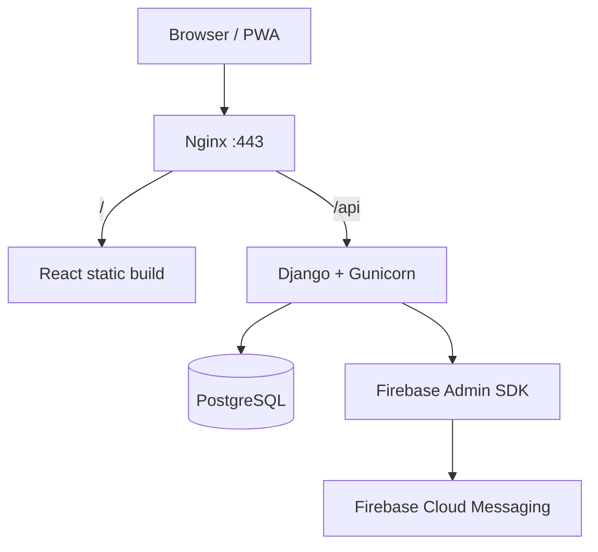

# SDD 01 — Arquitectura

## 1. Objetivo

Detallar la arquitectura lógica, física y las fronteras de módulos del MVP.

## 2. Topología recomendada



Una sola URL pública simplifica CORS, cookies y activación PWA. Ejemplo conceptual:

```text
https://colegio.example/
https://colegio.example/api/
```

## 3. Backend modular

### accounts

Responsable de User, autenticación, JWT, perfiles internos y permisos base.

### academics

Responsable de Student, Teacher, Guardian, cursos, materias, matrículas y asignaciones.

### grades

Responsable de calificaciones, validaciones y servicios bulk.

### attendance

Responsable de control de asistencia.

### qa

Responsable de Question/Answer.

### guardians

Responsable de relaciones tutor-estudiante, activation codes, device authorization y estado de dispositivo.

### alerts

Responsable de reglas y `AlertEvent`. No envía Push directamente.

### notifications

Responsable de crear `Notification`, resolver deliveries y ejecutar providers.

### reports

Consultas agregadas. No debe duplicar datos.

### audit

Registro inmutable de acciones relevantes.

## 4. Regla de dependencias

- Views/ViewSets llaman Services.
- Services encapsulan negocio y transacciones.
- Serializers validan forma/inputs, pero no deben convertirse en motor de negocio.
- Models contienen invariantes locales simples.
- Providers contienen integración externa.
- No realizar llamadas FCM desde signals de Django sin una capa explícita de servicio.

## 5. Consistencia transaccional

Para notas y asistencia:

```text
BEGIN
  validar scope docente
  validar filas
  persistir bulk
  crear audit logs
COMMIT
  evaluar alertas afectadas
```

Si la evaluación de alertas falla, el registro académico no debe perderse. El error se registra y puede re-evaluarse mediante cron/admin.

## 6. Scheduler

MVP:

- comando `python manage.py evaluate_alerts` cada noche;
- comando `python manage.py retry_notifications` cada hora o bajo demanda;
- evaluación inmediata después de cambios relevantes para la demo.

No incorporar Celery hasta que exista una necesidad real de throughput/reintentos avanzados.

## 7. Frontend

Una sola aplicación React con áreas de rutas:

```text
/auth/*
/admin/*
/teacher/*
/student/*
/guardian/*
```

Los bundles pueden compartirse, pero los guards de ruta no sustituyen permisos backend.

## 8. PWA

La PWA es un modo de distribución del mismo frontend, no un segundo proyecto.

Service worker:

- precache únicamente shell estático;
- maneja eventos Push y notification click;
- excluye `/api/`, dashboards y respuestas con datos sensibles del cache;
- actualiza versiones sin bloquear sesión.

## 9. Evolución futura

Se puede evolucionar sin romper el dominio:

```text
NotificationProvider
  ├─ FirebaseProvider   [MVP]
  ├─ WhatsAppProvider   [futuro]
  ├─ SmsProvider        [futuro]
  └─ EmailProvider      [futuro]
```

Solo si el volumen lo requiere, `notifications` puede extraerse posteriormente a worker/cola.
