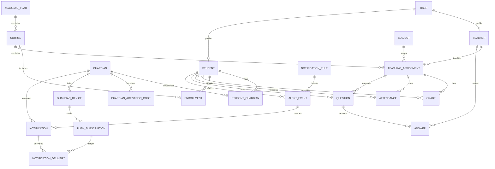

# SDD 02 — Modelo de datos

## 1. Convenciones

- PK: UUID preferido para entidades expuestas externamente; BigInt aceptable para entidades internas si el equipo prioriza simplicidad.
- Todas las entidades de negocio: `created_at`, `updated_at` cuando aplique.
- Fechas en UTC en backend; UI presenta zona local.
- Restricciones de unicidad en DB, no solo validaciones de UI.

## 2. Entidades

### User

```text
id
username
email
password_hash
role = ADMIN | TEACHER | STUDENT
is_active
last_login
```

### Teacher

```text
id
user_id UNIQUE FK User
first_name
last_name
document_number nullable
```

### Student

```text
id
user_id UNIQUE nullable FK User
code UNIQUE
first_name
last_name
active
```

`user_id` puede crearse al habilitar acceso del estudiante.

### Guardian

```text
id
full_name
phone nullable
email nullable
notifications_enabled bool
active bool
```

Guardian no apunta a `User` en MVP.

### StudentGuardian

```text
id
student_id FK
 guardian_id FK
relationship = MOTHER | FATHER | TUTOR | OTHER
is_primary bool
can_receive_notifications bool
UNIQUE(student_id, guardian_id)
```

### AcademicYear

```text
id
name
start_date
end_date
active
```

### Course

```text
id
academic_year_id
name
parallel
UNIQUE(academic_year_id, name, parallel)
```

### Subject

```text
id
name
code UNIQUE
```

### Enrollment

```text
id
student_id
course_id
academic_year_id
status = ACTIVE | WITHDRAWN | COMPLETED
UNIQUE(student_id, course_id, academic_year_id)
```

### TeachingAssignment

```text
id
teacher_id
course_id
subject_id
academic_year_id
active
UNIQUE(teacher_id, course_id, subject_id, academic_year_id)
```

### Grade

```text
id
student_id
teaching_assignment_id
term
activity_name
score decimal
max_score decimal
date
comments nullable
created_by User
updated_by User
```

### Attendance

```text
id
student_id
teaching_assignment_id
date
status = PRESENT | ABSENT | LATE | EXCUSED
comments nullable
created_by User
updated_by User
UNIQUE(student_id, teaching_assignment_id, date)
```

### Question

```text
id
student_id
teaching_assignment_id
subject
body
status = OPEN | ANSWERED | CLOSED
created_at
```

### Answer

```text
id
question_id
teacher_id
body
published_at
```

### NotificationRule

```text
id
name
type = LOW_GRADE | ABSENCE | REPEATED_ABSENCE | LATE
enabled
threshold_value nullable
period_days nullable
cooldown_hours nullable
```

No guardar texto de Push sensible en la regla. La regla identifica el evento; la UI de detalle genera contenido autorizado.

### AlertEvent

```text
id
rule_id
student_id
source_type = GRADE | ATTENDANCE | AGGREGATE
source_id nullable
fingerprint UNIQUE
severity = INFO | WARNING | CRITICAL
status = OPEN | RESOLVED
first_detected_at
last_detected_at
```

`fingerprint` permite deduplicación determinística.

### GuardianActivationCode

```text
id
guardian_id
code_hash
expires_at
used_at nullable
revoked_at nullable
created_by User
max_attempts default configurable
```

El código plano nunca se guarda.

### GuardianDevice

```text
id
guardian_id
name nullable
platform = WEB | ANDROID_PWA | IOS_PWA | UNKNOWN
user_agent_hash nullable
is_active
linked_at
last_seen_at
unlinked_at nullable
```

### PushSubscription

```text
id
guardian_device_id
provider = FCM
token_encrypted_or_protected
is_active
last_success_at nullable
last_error_at nullable
last_error_code nullable
created_at
updated_at
UNIQUE(provider, token_hash)
```

El token FCM es una credencial de entrega; no se expone en logs.

### Notification

```text
id
alert_event_id
guardian_id
student_id
category
safe_title
safe_body
created_at
read_at nullable
```

### NotificationDelivery

```text
id
notification_id
push_subscription_id
provider = FCM
status = PENDING | SENT | FAILED | INVALID_TOKEN | SKIPPED
provider_message_id nullable
attempt_count
last_attempt_at
error_code nullable
error_message_redacted nullable
UNIQUE(notification_id, push_subscription_id)
```

### AuditLog

```text
id
actor_user_id nullable
actor_guardian_device_id nullable
action
entity
entity_id
metadata_json_redacted
created_at
ip_hash nullable
```

## 3. ERD



## 4. Índices mínimos

- Grade: `(student_id, teaching_assignment_id, term)`.
- Attendance: `(student_id, date)`, `(teaching_assignment_id, date)`.
- Question: `(teaching_assignment_id, status, created_at)`.
- AlertEvent: `(student_id, status)`, UNIQUE `fingerprint`.
- Notification: `(guardian_id, created_at DESC)`.
- NotificationDelivery: `(status, last_attempt_at)`.
- GuardianActivationCode: `(guardian_id, expires_at)`.

## 5. Retención MVP

- Audit y notificaciones no se borran desde UI normal.
- PushSubscription inválida se desactiva, no se elimina inmediatamente.
- Activation codes expirados pueden limpiarse por job después de un período configurable.
